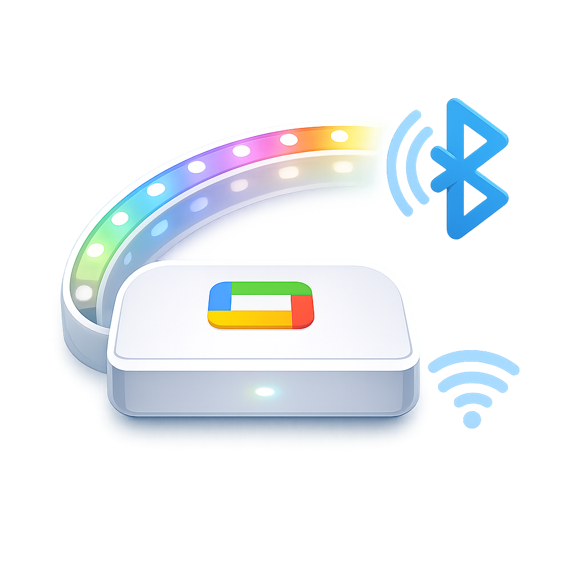

  

<h1 align="center">Govee TV LED Backlight Bluetooth Proxy</h1>

  A polished Home Assistant bridge that keeps a Bluetooth-only Govee TV backlight visible, stable, and Google Home friendly.

  
  
  
  
  
  

## What This Repo Does

This project packages a working setup for exposing a Bluetooth-only Govee TV backlight to Google Home through Home Assistant.

It solves the specific pain point where the raw BLE entity can boot into `unknown`, which then makes the Google-visible proxy light show as offline or unavailable. The fix in this repo restores the BLE entity's last known state on startup, then exposes a template light to Google Assistant with active state reporting enabled.

## Highlights

- ✨ Stabilizes a Bluetooth Govee TV backlight inside Home Assistant
- 🩹 Includes the restore-state patch for `custom_components/govee_ble_lights/light.py`
- 🏠 Exposes a Google Home friendly proxy entity instead of the raw BLE light
- 🔁 Documents quick migration from Raspberry Pi / DietPi to another host such as Unraid
- 🔐 Keeps secrets out of git by design
- 🧭 Includes architecture docs, migration steps, and Google testing-mode notes

## Architecture

## Repo Layout

- `custom_components/govee_ble_lights/`
  Patched custom integration code for the BLE light.
- `ha-snippets/google_tv_led_back_light.yaml`
  Drop-in Home Assistant configuration snippet for the proxy entity and Google Assistant exposure.
- `notes/device-info.yaml`
  Working device-specific metadata captured from the live setup.
- `docs/MIGRATION.md`
  End-to-end move guide for another Home Assistant machine.
- `docs/GOOGLE_HOME_TEST_MODE.md`
  What to expect from Google's test app limitations and how to recover sync.

## Fast Start

1. Copy `custom_components/govee_ble_lights` into the target Home Assistant config directory.
2. Merge `ha-snippets/google_tv_led_back_light.yaml` into `configuration.yaml`.
3. Add your target host's `SERVICE_ACCOUNT.json`.
4. Restart Home Assistant.
5. Re-add the `govee_ble_lights` integration and select model `H617C`.
6. Verify `light.govee_light` exists and the proxy entity `light.tv_led_back_light_google` appears.
7. Run a Google device sync.

## Documentation

- 📦 [Migration guide](docs/MIGRATION.md)
- ☁️ [Google Home test-mode notes](docs/GOOGLE_HOME_TEST_MODE.md)
- 🧾 [Current device profile](docs/DEVICE_PROFILE.md)

## Current Device Snapshot

- Device name: `TV LED Back Light`
- Source entity: `light.govee_light`
- Google proxy entity: `light.tv_led_back_light_google`
- Model: `H617C`
- BLE unique ID: `CC3333356529`
- Likely BLE MAC: `CC:33:33:35:65:29`
- Current Google project ID: `dietpi-home-assistant`

## What Is Not Included

- `SERVICE_ACCOUNT.json`
- OAuth client secrets
- The full Home Assistant config directory
- Host-specific secret material

## Why This Exists

This repo is meant to make the working setup portable. If you repurpose the Raspberry Pi later, you should be able to lift this project to another Home Assistant host quickly instead of rediscovering the same BLE and Google Home edge cases from scratch.
