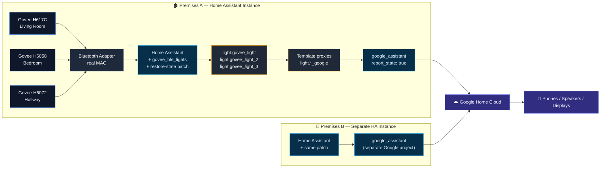

<p align="center">
  
</p>

<h1 align="center">Govee TV LED Backlight Bluetooth Proxy</h1>

<p align="center">
  A versatile, modular Home Assistant toolkit that keeps Bluetooth-only Govee lights visible, stable, and Google Home friendly — at one device or one hundred, on one premises or many.
</p>

<p align="center">
  
  
  
  
  
  
  
  
  
</p>

---

## ✨ What This Repo Does

Bluetooth-only Govee lights ship without Wi-Fi and without official Google Home support. This project bridges them — cleanly, predictably, and at scale.

It packages four things that work together:

1. 🩹 A **patched custom integration** that prevents the BLE entity from booting into `unknown`
2. 🪞 A **template-proxy pattern** that exposes a stable, Google-friendly entity to Google Assistant
3. 🧰 A **YAML generator** that turns a simple devices registry into a full Home Assistant config block
4. 🛠 A **bluetooth-repair script** that fixes the silent `AA:AA:AA:AA:AA:AA` placeholder-MAC failure mode

You drop in the patch, declare your devices, run the generator, expose to Google. Adding device #2 looks identical to device #1.

---

## 🏗 Architecture



The same three-layer flow scales from one device to many, and from one premises to many. Only the YAML grows.

---

## 🚀 Quick Start

Pick your path.

| You want to … | Start here |
| --- | --- |
| 🪄 Set up the very first device | [Single-device setup](#-single-device-setup) |
| 🧩 Add another device on the same Home Assistant | [`docs/MULTI_DEVICE.md`](docs/MULTI_DEVICE.md) §"Same Premises" |
| 🏡 Set up the same proxy on a new premises | [`docs/MULTI_DEVICE.md`](docs/MULTI_DEVICE.md) §"Different Premises" + [`docs/MIGRATION.md`](docs/MIGRATION.md) |
| 🛟 Recover from "device offline" in Google Home | [`docs/TROUBLESHOOTING.md`](docs/TROUBLESHOOTING.md) |
| 🤖 Generate YAML for a registry of devices | [`scripts/generate_yaml.py`](scripts/generate_yaml.py) |

### 🪄 Single-device setup

1. Copy `custom_components/govee_ble_lights/` into the target Home Assistant `config/` directory
2. Edit [`ha-snippets/devices.example.yaml`](ha-snippets/devices.example.yaml) → keep one device, fill in your project ID and URLs
3. Generate the config block:

   ```bash
   python3 scripts/generate_yaml.py ha-snippets/devices.example.yaml > my-block.yaml
   ```

4. Merge `my-block.yaml` into your `configuration.yaml`
5. Drop your Google `SERVICE_ACCOUNT.json` into the HA config directory
6. Restart HA, pair the Govee via **Settings → Devices & Services → Discovered**, sync Google Home

That's it.

---

## 📦 Repo Layout

```text
custom_components/govee_ble_lights/   Patched integration with restore-state
docs/
  MULTI_DEVICE.md                     Adding devices, scaling, naming
  TROUBLESHOOTING.md                  Failure modes + recipes
  MIGRATION.md                        Move HA between hosts
  GOOGLE_HOME_TEST_MODE.md            Google test-mode caveats
  DEVICE_PROFILE.md                   Live device snapshot
  CHANGELOG.md                        Version history
ha-snippets/
  devices.example.yaml                Devices registry (input to generator)
  example-multi-device.yaml           Generator output for 3 devices (ready to paste)
  google_tv_led_back_light.yaml       Original single-device snippet (kept for reference)
scripts/
  generate_yaml.py                    Devices registry -> HA YAML block
  repair_bluetooth_mac.sh             Fix the AA:AA:AA placeholder-MAC bug
  README.md                           Script docs
notes/
  device-info.yaml                    Machine-readable device profile
```

---

## 🧠 Key Concepts

### The three-layer pattern

Every Govee BLE light flows through:

- **BLE source** — `light.govee_light`, `light.govee_light_2`, … (created by the integration)
- **Template proxy** — `light.<descriptor>_google` (defined in `configuration.yaml`)
- **Google exposure** — entry under `google_assistant.entity_config:`

The template proxy provides a stable identity to Google even when the BLE source flickers. The restore-state patch ensures the BLE source itself doesn't boot into `unknown`.

### Granular control

Every exposed entity is independent. Per-device voice control, per-device color/brightness, per-device automations, per-room grouping — all work out of the box. See [`docs/MULTI_DEVICE.md`](docs/MULTI_DEVICE.md#granular-control).

### One Google project per Home Assistant

Reuse the same `project_id` and `SERVICE_ACCOUNT.json` for every device on a given HA instance. Create a new Google project only when standing up a new HA instance on a different premises.

---

## 🔒 Security

This repo is **security-hardened**. Three layers gate every commit and push:

1. **Pre-commit** — `detect-secrets`, `gitleaks`, `shellcheck`, `ruff`, `yamllint`, `markdownlint`, plus generic safety checks (private keys, large files, merge markers)
2. **GitHub Actions** — re-runs all pre-commit hooks + `trivy` filesystem scan + `skylos` dead-code on every push/PR
3. **Weekly schedule** — re-scans against fresh CVE databases every Monday

See [`SECURITY.md`](SECURITY.md) for the full tooling reference, vulnerability reporting policy, and local setup instructions.

```bash
# One-time setup after cloning
brew install pre-commit && pre-commit install
pre-commit run --all-files     # confirm clean
```

---

## 📓 Changelog

> Full history: [`docs/CHANGELOG.md`](docs/CHANGELOG.md)

### 🔒 v1.2.0 — 2026-04-27

- 🛡 **Security-hardened** — pre-commit hooks for secrets, lint, format
- 🔍 **detect-secrets** + **gitleaks** with managed baselines
- ⚙️ **GitHub Actions** — gitleaks, trivy fs, pre-commit, skylos (advisory)
- 📖 **`SECURITY.md`** — reporting, tooling, baseline policy

### 🎉 v1.1.0 — 2026-04-27

- ✨ **Multi-device toolkit** — new `docs/MULTI_DEVICE.md`, devices registry, and a YAML generator
- 🛠 **Bluetooth repair script** — fixes the `AA:AA:AA:AA:AA:AA` placeholder-MAC failure with backup + rollback
- 📚 **Troubleshooting catalog** — every failure mode hit in production, with concrete fixes
- 🎨 **New mermaid architecture** — multi-device, multi-premises view
- 🏷 **Badges, changelog, polished README**

### v1.0.0 — 2026-03

- 🩹 Restore-state patch for the BLE entity
- 🏠 Single-device template proxy pattern
- 🧭 Migration and Google test-mode docs

---

## 🗺 Documentation Index

- 🧩 [Multi-device guide](docs/MULTI_DEVICE.md) — extending pluggable, adding new devices, granular control on same and different premises
- 🛟 [Troubleshooting](docs/TROUBLESHOOTING.md) — every failure mode with a recipe
- 📦 [Migration guide](docs/MIGRATION.md) — moving Home Assistant between hosts
- ☁️ [Google Home test-mode notes](docs/GOOGLE_HOME_TEST_MODE.md) — sync quirks and recovery
- 🧾 [Device profile](docs/DEVICE_PROFILE.md) — live device snapshot
- 📓 [Changelog](docs/CHANGELOG.md) — full version history
- 🛠 [Scripts](scripts/README.md) — generator and repair tool docs

---

## 🔒 What Is Not Included

- `SERVICE_ACCOUNT.json` (bring your own per HA instance)
- OAuth client secrets
- Full Home Assistant config directories
- Any host-specific secrets

This is by design — the repo is meant to be lifted cleanly to any HA host without dragging credentials with it.

---

## 🌱 Why This Exists

Bluetooth-only Govee lights are cheap, pretty, and underserved. Without this glue, they sit isolated from the rest of your smart home. With it, they behave like first-class Google Home devices — reliably across reboots, scalable across rooms and houses, and recoverable when bluez does something weird.

Built once on a Raspberry Pi running DietPi. Designed to outlive that Pi.
