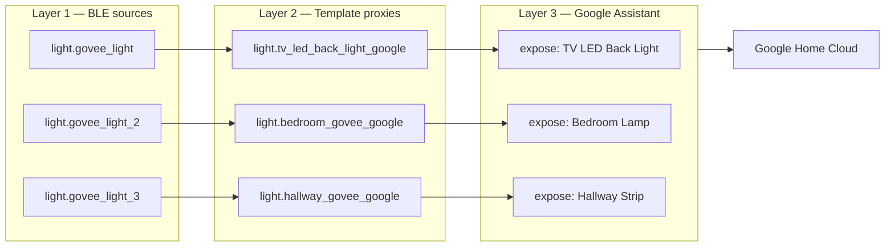

# Multi-Device Guide

This guide explains how to extend the proxy pattern to multiple Govee BLE lights, both **on the same premises** (one Home Assistant instance) and **across different premises** (separate Home Assistant instances).

The same custom integration, the same restore-state patch, and the same template-proxy idea cover every case. Only the YAML scales.

---

## Mental Model

Each BLE light flows through three layers:

1. **BLE source entity** — created automatically by `govee_ble_lights` per device (e.g. `light.govee_light`, `light.govee_light_2`)
2. **Template proxy entity** — a Google-friendly wrapper, one per BLE source (e.g. `light.tv_led_back_light_google`)
3. **Google Assistant exposure** — declares which proxies Google Home can see



To add a device, you replicate the same three rows. Nothing else changes.

---

## Same Premises — Add Another Device

You already have a working Home Assistant on this premises. Adding another Govee BLE light is a 4-step copy.

### 1. Pair the device

Power on the new Govee light. Home Assistant's bluetooth integration will auto-discover it and prompt you in **Settings → Devices & Services → Discovered**.

Click **Configure**, choose the model (H617C, H6058, etc.), and finish.

A new BLE entity appears — by convention `light.govee_light_2`, `light.govee_light_3`, …

### 2. Duplicate the template block

In `configuration.yaml`, add a second item under `template: → light:`:

```yaml
template:
  - light:
      # existing TV LED Back Light entry stays unchanged …

      - default_entity_id: light.bedroom_govee_google
        unique_id: bedroom_govee_google
        name: "Bedroom Govee Google"
        availability: "{{ states('light.govee_light_2') not in ['unknown', 'unavailable'] }}"
        state: "{{ is_state('light.govee_light_2', 'on') }}"
        level: "{{ state_attr('light.govee_light_2', 'brightness') | default(0, true) | int }}"
        hs: "{{ state_attr('light.govee_light_2', 'hs_color') or (0, 0) }}"
        turn_on:
          action: light.turn_on
          target: { entity_id: light.govee_light_2 }
        turn_off:
          action: light.turn_off
          target: { entity_id: light.govee_light_2 }
        set_level:
          action: light.turn_on
          target: { entity_id: light.govee_light_2 }
          data:
            brightness: "{{ brightness }}"
        set_hs:
          action: light.turn_on
          target: { entity_id: light.govee_light_2 }
          data:
            hs_color: ["{{ h }}", "{{ s }}"]
            brightness: "{{ brightness | default(state_attr('light.govee_light_2', 'brightness') | default(255, true), true) }}"
```

The pattern is identical to the first entry — only entity IDs and names change.

### 3. Expose to Google

Under `google_assistant.entity_config:`:

```yaml
google_assistant:
  project_id: your-project-id
  service_account: !include SERVICE_ACCOUNT.json
  report_state: true
  expose_by_default: false
  entity_config:
    light.tv_led_back_light_google:
      expose: true
      name: TV LED Back Light
      room: Living Room

    light.bedroom_govee_google:
      expose: true
      name: Bedroom Lamp
      room: Bedroom
```

### 4. Reload + sync

```yaml
# In HA: Developer Tools → YAML → Reload Template Entities
# Then either say "Hey Google, sync my devices" or call:
#   service: google_assistant.request_sync
```

Google Home now shows two independent devices.

### Tip — use the generator script

If you have more than two devices, hand-editing YAML gets tedious. Use [`scripts/generate_yaml.py`](../scripts/generate_yaml.py):

```bash
# Edit ha-snippets/devices.example.yaml to list your devices,
# then generate the full configuration.yaml block:
python3 scripts/generate_yaml.py ha-snippets/devices.example.yaml > my-config-block.yaml
```

Paste the generated block into `configuration.yaml`.

---

## Different Premises — Standalone Install

A different premises means a different Home Assistant instance, a different bluetooth adapter, and almost always a different Google account or different Google Cloud project.

### Recommended split

| Component | Same premises | Different premises |
| --- | --- | --- |
| Home Assistant instance | shared | separate |
| `custom_components/govee_ble_lights/` | shared | copy from this repo |
| Bluetooth adapter | shared | separate |
| Google Cloud project / SERVICE_ACCOUNT.json | shared | **separate** |
| Template proxies | grow same file | start fresh |

### Setup steps for the new premises

1. Install Home Assistant on the new host (any flavor — Container, Core, Supervised, OS)
2. Copy the entire repo's `custom_components/govee_ble_lights/` folder into the target HA's config directory
3. Create a new Google Cloud project for this premises (instructions in [`MIGRATION.md`](MIGRATION.md))
4. Drop a fresh `SERVICE_ACCOUNT.json` into the new HA config dir
5. Use the generator script to scaffold a starting `configuration.yaml` block for the devices on this premises:

   ```bash
   python3 scripts/generate_yaml.py path/to/your-devices.yaml
   ```

6. Restart HA, pair the BLE devices, sync Google Home

### Why a new Google Cloud project per premises

The Google Assistant integration links **one HA instance ↔ one Google Cloud project ↔ one Google account at a time**. Reusing a single project across two HAs causes device-sync confusion and OAuth state drift.

If both premises use the same Google account, that's fine — just create two distinct projects (e.g. `home-ha-livingroom`, `cottage-ha-main`) and the same account can own both.

---

## Granular Control

Every exposed entity in Google Home is independent. Things you can do:

- **Per-device voice commands** — "Turn on TV LED Back Light", "Dim Bedroom Lamp to 30%"
- **Per-device color/brightness** — full HS color and brightness pass through the proxy
- **Room grouping** — set `room:` per entity in `entity_config:` so Google Home commands like "Turn on Living Room lights" hit only that room
- **Routines** — combine devices in Google Home routines ("Goodnight" turns off all four)
- **HA scenes** — define HA scenes mixing multiple Govee + non-Govee entities and expose just the scene
- **Per-device automations** — HA automations target individual `light.govee_light_N` entities

Granularity is **per HA entity**, not per integration or per device class. As long as each Govee BLE light has its own template proxy, you control each one separately end-to-end.

---

## Naming Conventions That Scale

When you have several devices, naming consistency keeps the YAML readable.

| Layer | Convention | Examples |
| --- | --- | --- |
| BLE source | `light.govee_light_<N>` (auto) | `light.govee_light`, `light.govee_light_2` |
| Template proxy | `light.<descriptor>_google` | `light.tv_led_back_light_google`, `light.bedroom_govee_google` |
| `unique_id` | matches proxy entity ID | `tv_led_back_light_google` |
| Google `name:` | human-readable, no "google" suffix | "TV LED Back Light", "Bedroom Lamp" |
| Google `room:` | matches your Google Home room | `Living Room`, `Bedroom` |

Stick to this and adding device #5 looks identical to adding device #2.

---

## Quick Reference

| You want to … | Use this |
| --- | --- |
| Add a device on the same premises | This guide §"Same Premises" |
| Set up the proxy on a new premises | This guide §"Different Premises" + [`MIGRATION.md`](MIGRATION.md) |
| Generate YAML for many devices at once | [`scripts/generate_yaml.py`](../scripts/generate_yaml.py) |
| Recover from "device offline" in Google Home | [`TROUBLESHOOTING.md`](TROUBLESHOOTING.md) |
| Understand Google's test-mode quirks | [`GOOGLE_HOME_TEST_MODE.md`](GOOGLE_HOME_TEST_MODE.md) |
